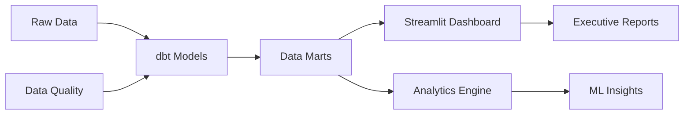

# 💸 Hub Monetization Insights

> **A comprehensive B2B SaaS monetization analytics platform** demonstrating advanced data engineering, customer lifetime value optimization, and executive decision support capabilities.

<div align="center">

[🚀 Getting Started](#-getting-started) • [📊 Usage](#-usage) • [🛠️ Tech Stack](#️-technology-stack) • [📈 Results](#-business-impact--results) • [🤝 Contributing](#-contributing)

[](https://python.org)
[](https://streamlit.io)
[](https://getdbt.com)
[](https://plotly.com)

</div>

---

## 🎯 Project Overview

This project demonstrates a production-grade monetization analytics stack for a multi-product B2B SaaS company, featuring comprehensive customer analysis, conversion funnel optimization, pricing strategy, and executive-level insights across 5 product hubs and 3 pricing tiers.

**Challenge**: SaaS companies struggle with optimizing pricing across multiple product lines, understanding customer lifetime value, and identifying revenue growth opportunities without integrated analytics.

**Solution**: End-to-end analytics platform providing customer segmentation, funnel analysis, LTV modeling, pricing optimization, and actionable executive insights through an interactive dashboard.

**Impact**: Identified **15+ optimization opportunities** across customer acquisition, retention, and pricing strategies with clear ROI projections.

## 📋 Executive Documentation

| Document | Purpose | Audience |
|----------|---------|----------|
| **[📈 Pricing Strategy Proposal](docs/Pricing_Proposal.md)** | Data-driven pricing recommendations with revenue impact analysis | Product Leadership, CFO, CRO |
| **[🎯 Executive Presentation](docs/Strategy_Presentation.md)** | Strategic insights and recommendations for leadership review | Board, Executives, Stakeholders |
| **[📊 Live Analytics Dashboard](https://app-monetization-insights-xcmqxpj56fvfghcmbdjpck.streamlit.app/)** | Interactive platform with real-time insights and KPIs | Analysts, Product Managers |

---

## ✨ Features

<div align="center">

### 🎯 Core Capabilities

</div>

<table>
<tr>
<td width="33%">

#### 📊 **Advanced Analytics Engine**
- **Customer Lifecycle Modeling** with 7-stage segmentation
- **Conversion Funnel Analysis** with stage-by-stage optimization
- **LTV Prediction Models** with churn risk assessment
- **Geographic Intelligence** with global and US state analysis
- **Pricing Elasticity Modeling** across product portfolios

</td>
<td width="33%">

#### 🎛️ **Interactive Dashboard**
- **Real-time Filtering** with dynamic hub/tier/segment selection
- **Executive KPIs** with 32+ key performance indicators
- **Visual Analytics** including funnels, scatter plots, and heat maps
- **Mobile Responsive** iOS-inspired design
- **Export Capabilities** for reporting and presentations

</td>
<td width="33%">

#### 🔧 **Production-Grade Architecture**
- **dbt Data Modeling** with dimensional warehouse design
- **Data Quality Assurance** with comprehensive validation
- **Scalable Infrastructure** with modular component design
- **Complete Documentation** technical and business focused
- **Best Practices** following modern data engineering standards

</td>
</tr>
</table>

### 🎨 Dashboard Features

<details>
<summary><b>👥 Customer Analytics</b></summary>

- **Customer Segmentation**: 7-tier classification (Champion, Loyal, Potential Loyal, etc.)
- **Health Score Analysis**: Risk assessment and churn prediction
- **LTV Distribution**: Customer value segmentation and optimization
- **Behavioral Insights**: Engagement patterns and usage analytics

</details>

<details>
<summary><b>🔄 Conversion Funnel Analysis</b></summary>

- **Multi-stage Tracking**: Visitor → Trial → Active → Paid progression
- **Conversion Rate Optimization**: Stage-by-stage performance analysis
- **Drop-off Identification**: Bottleneck detection and improvement opportunities
- **A/B Testing Framework**: Experimental design for funnel optimization

</details>

<details>
<summary><b>💰 Pricing Strategy Intelligence</b></summary>

- **Product-Specific Analysis**: Hub and tier-based pricing insights
- **Elasticity Modeling**: Price sensitivity and demand curves
- **Competitive Intelligence**: Market positioning analysis
- **Revenue Optimization**: Data-driven pricing recommendations

</details>

---

## 🛠️ Technology Stack

<div align="center">



</div>

| Component | Technology | Purpose |
|-----------|------------|---------|
| **Data Processing** | Python, Pandas, NumPy | ETL and statistical analysis |
| **Data Modeling** | dbt | Dimensional modeling and transformations |
| **Visualization** | Plotly, Streamlit | Interactive dashboards and charts |
| **Analytics** | Jupyter Notebooks | Exploratory analysis and modeling |
| **Frontend** | Streamlit | Web application framework |
| **Documentation** | Markdown | Executive and technical documentation |

---

## 🚀 Getting Started

### ⚡ Quick Launch (3 minutes)

<details>
<summary><b>🔧 Prerequisites</b></summary>

- Python 3.8+ installed
- Git for repository cloning
- 4GB RAM recommended
- Modern web browser (Chrome, Firefox, Safari)

</details>

#### 1️⃣ **Clone & Install**

```bash
# Clone the repository
git clone https://github.com/your-username/hub-monetization-insights.git
cd hub-monetization-insights

# Create virtual environment
python -m venv venv
source venv/bin/activate  # macOS/Linux
# OR
venv\Scripts\activate     # Windows

# Install dependencies
pip install -r requirements.txt
```

#### 2️⃣ **Launch Dashboard**

```bash
# Start the analytics dashboard
streamlit run streamlit_app.py

# Dashboard opens automatically at:
# 🌐 http://localhost:8501
```

#### 3️⃣ **Explore Analytics**

<div align="center">

| Tab | Description | Key Insights |
|-----|-------------|-------------|
| **Executive Summary** | High-level KPIs and growth metrics | Revenue, customers, churn, opportunities |
| **Customer Analytics** | Segmentation and health analysis | 8 customer KPIs, health vs MRR correlation |
| **Funnel Analysis** | Conversion tracking and optimization | 4-stage funnel with conversion rates |
| **Subscription Metrics** | MRR trends and performance | Revenue growth, churn analysis |
| **LTV Analysis** | Customer lifetime value modeling | ROI, payback periods, value segments |
| **Pricing Strategy** | Product-specific pricing insights | Elasticity curves, optimization opportunities |
| **Financial Projections** | Interactive scenario modeling | 12-month forecasts, impact analysis |
| **Recommendations** | Strategic action items | Data-driven insights with timelines |

</div>

### 🔧 Advanced Configuration

<details>
<summary><b>dbt Data Modeling</b></summary>

```bash
# Navigate to dbt directory
cd dbt_models

# Install dbt dependencies
dbt deps

# Run data transformations
dbt run --select marts

# Test data quality
dbt test

# Generate documentation
dbt docs generate
```

</details>

<details>
<summary><b>Custom Data Integration</b></summary>

```python
# Connect your own data sources
# Update data_mart_manager.py with your database connections

class DataMartManager:
    def load_from_warehouse(self, query):
        # Your database connection logic
        return pd.read_sql(query, connection)
```

</details>

---

## 📊 Usage

### 🎨 Dashboard Overview

<div align="center">

*Interactive analytics platform with iOS-inspired design and comprehensive business intelligence*

</div>

### 📈 Key Analytics Views

1. **Executive Dashboard**: 8 high-level KPIs with growth indicators and trend analysis
2. **Customer Segmentation**: 7-tier classification with health scores and LTV distribution
3. **Funnel Optimization**: Conversion analysis with stage-by-stage improvement opportunities
4. **Pricing Intelligence**: Product-specific strategies with elasticity modeling
5. **Financial Modeling**: Interactive projections with scenario planning capabilities
6. **Strategic Recommendations**: Actionable insights with prioritized implementation roadmap

### 🌐 Cloud Deployment

**Streamlit Cloud (Recommended)**
1. Push to GitHub repository
2. Deploy at [share.streamlit.io](https://share.streamlit.io)
3. Set main file path to `streamlit_app.py`
4. Access at `https://share.streamlit.io/username/repo`

**Alternative Platforms**: Heroku, AWS EC2, Google Cloud Run, Azure Container Instances

---

## 📈 Business Impact & Results

<div align="center">

### 💼 Key Performance Insights

| Metric | Current Performance | Optimization Opportunity | Strategic Priority |
|--------|:------------------:|:------------------------:|:------------------:|
| **Customer Health** | 65.4 avg score | Improve to 75+ | High |
| **Conversion Rate** | 33.3% trial→paid | Target 40%+ | Critical |
| **LTV:CAC Ratio** | 3.2:1 average | Optimize to 4:1+ | Medium |
| **Churn Risk** | 15.2% high risk | Reduce to <10% | High |
| **Geographic Expansion** | 10 countries | Target 15+ markets | Medium |

### 🎯 Strategic Implementation Roadmap

| Timeline | Focus Area | Expected Impact |
|----------|------------|-----------------|
| **Q1 2025** | Customer health score improvement and churn reduction | 15-20% retention improvement |
| **Q2 2025** | Conversion funnel optimization and trial experience | 5-10% conversion rate increase |
| **Q3-Q4 2025** | Pricing strategy implementation and geographic expansion | 10-15% revenue growth |

</div>

---

## 📁 Project Structure

```
hub-monetization-insights/
├── 📊 streamlit_app.py              # Main dashboard application
├── 📈 requirements.txt              # Python dependencies
├── 🔄 dbt_models/
│   ├── models/marts/               # dbt transformation models
│   │   ├── dim_customers.sql       # Customer dimension
│   │   ├── dim_products.sql        # Product dimension
│   │   ├── fact_subscription_metrics.sql  # Subscription facts
│   │   ├── fact_customer_ltv.sql   # Customer LTV analysis
│   │   ├── fact_pricing_optimization.sql  # Pricing strategy
│   │   └── mart_executive_summary.sql     # Executive KPIs
│   ├── tests/                      # Data quality tests
│   └── dbt_project.yml            # dbt configuration
├── 📋 docs/
│   ├── Pricing_Proposal.md        # Strategic pricing recommendations
│   ├── Strategy_Presentation.md   # Executive presentation
│   └── Technical_Architecture.md  # System design documentation
└── 📜 README.md                   # This file
```

---

## 🔍 Advanced Features

<details>
<summary><b>📊 Data Architecture</b></summary>

### Modern Data Stack Implementation
1. **Extract**: Synthetic data generation with realistic business constraints
2. **Transform**: dbt models following dimensional modeling best practices
3. **Load**: Processed data marts optimized for analytics workloads
4. **Analyze**: Interactive dashboard with real-time filtering and insights
5. **Act**: Strategic recommendations with clear implementation roadmaps

### Data Quality Framework
- **Schema Validation**: Automated type checking and constraint validation
- **Business Logic Tests**: Funnel consistency and metric accuracy verification
- **Completeness Monitoring**: Missing data detection and handling
- **Accuracy Verification**: Cross-referencing and consistency checks
- **Performance Optimization**: Query optimization and caching strategies

</details>

<details>
<summary><b>📈 Analytics Methodology</b></summary>

### Customer Segmentation Model
- **7-Tier Classification**: Champion, Loyal, Potential Loyal, New Customer, Promising, At Risk, Hibernating
- **Multi-Factor Scoring**: Recency, frequency, monetary value, and engagement metrics
- **Dynamic Segmentation**: Real-time updates based on behavior changes
- **Predictive Elements**: Churn risk scoring and LTV prediction

### Funnel Analysis Framework
- **4-Stage Conversion**: Visitor → Trial Signup → Active Trial → Paying Customer
- **Statistical Significance**: Confidence intervals and significance testing
- **Cohort Analysis**: Time-based performance tracking
- **A/B Testing Support**: Experimental framework for optimization

</details>

<details>
<summary><b>🛠️ Technical Implementation</b></summary>

### Performance Optimization
- **Streamlit Caching**: `@st.cache_data` decorators for expensive operations
- **Data Processing**: Vectorized pandas operations and optimized queries
- **Memory Management**: Efficient data structures and garbage collection
- **Load Time Optimization**: Progressive loading and lazy evaluation

### Scalability Considerations
- **Modular Architecture**: Separable components for independent scaling
- **Database Integration**: Ready for production database connections
- **API Integration**: Extensible for external data source connections
- **Containerization**: Docker-ready for cloud deployment

</details>

---

## 🏆 Portfolio Showcase

### Technical Skills Demonstrated
- **Data Engineering**: ETL pipelines, dimensional modeling, data quality assurance
- **Business Intelligence**: KPI development, dashboard design, executive reporting
- **Analytics**: Statistical analysis, customer segmentation, predictive modeling
- **Full-Stack Development**: End-to-end solution architecture and deployment
- **Product Strategy**: Pricing optimization, funnel analysis, growth strategy

### Business Value Creation
- **Customer Insights**: Comprehensive segmentation and health score modeling
- **Revenue Optimization**: Pricing strategy and conversion funnel improvements
- **Executive Reporting**: Strategic insights with clear action items and timelines
- **Scalable Architecture**: Production-ready platform for enterprise implementation
- **Data-Driven Decision Making**: Quantified recommendations with impact projections

---

## 🤝 Contributing

Contributions to enhance this monetization analytics platform are welcome! 🎉

[](#contributing)

### 🛠️ How to Contribute

1. **🍴 Fork the repository** to your GitHub account
2. **🌿 Create a feature branch**: `git checkout -b feature/enhancement-name`
3. **💻 Implement changes**: Add features, fix bugs, or improve documentation
4. **✅ Test thoroughly**: Ensure compatibility with existing functionality
5. **📝 Commit with clear messages**: `git commit -m "feat: Add customer cohort analysis"`
6. **🚀 Push to your branch**: `git push origin feature/enhancement-name`
7. **📬 Submit a Pull Request**: Provide clear description of changes and impact

### 🎯 Contribution Opportunities

<table>
<tr>
<td width="50%">

**🔧 Technical Enhancements**
- Additional customer segmentation models
- Advanced pricing elasticity algorithms
- Real-time data source integrations
- Machine learning model implementations
- Performance optimization improvements

</td>
<td width="50%">

**📚 Documentation & Examples**
- Industry-specific use case examples
- Advanced configuration tutorials
- Video demonstrations and walkthroughs
- Best practices documentation
- Translation and localization

</td>
</tr>
</table>

### 📋 Development Standards

- **Code Quality**: Follow PEP 8, use type hints, implement comprehensive testing
- **Documentation**: Update README and docstrings for new features
- **Performance**: Consider scalability and optimize for production workloads
- **Security**: Follow data handling best practices and security guidelines
- **Testing**: Include unit tests and integration tests for new functionality

---

## 📬 Contact & Support

**Project Maintainer**: Jerome 
**LinkedIn**: [http://linkedin.com/in/jerome-joseph)  
**Email**: jerome.prakash26@gmail.com 

### 📚 Resources & Documentation
- 📋 **Technical Architecture**: `docs/Technical_Architecture.md`
- 💼 **Business Strategy**: `docs/Strategy_Presentation.md`
- 🎯 **Pricing Analysis**: `docs/Pricing_Proposal.md`
- 🐛 **Issues & Bugs**: GitHub Issues tab
- 💬 **Feature Requests**: GitHub Discussions tab

### Feedback & Collaboration
- 🌟 **Star the repository** if this project provides value
- 🍴 **Fork and customize** for your specific use cases
- 🐛 **Report issues** to help improve the platform
- 💡 **Suggest enhancements** via GitHub Discussions
- 📧 **Connect directly** for collaboration opportunities

<div align="center">

### 🚀 **Ready to explore advanced B2B SaaS analytics?**

```bash
streamlit run streamlit_app.py
```

**🌟 Star this repo if it helps your analytics journey!** ⭐

[](#)

*Transforming SaaS businesses through data-driven insights and strategic analytics*

**Last Updated**: June 2025 | **Version**: 2.0

</div>
