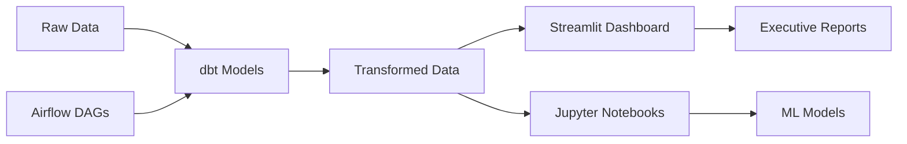

# 💸 Hub Monetization Insights

> **A comprehensive B2B SaaS monetization analytics platform** demonstrating end-to-end data engineering, pricing optimization, and executive decision support capabilities.

<div align="center">

[🚀 Getting Started](#-getting-started) • [📊 Usage](#-usage) • [🛠️ Tech Stack](#️-technology-stack) • [📈 Results](#-business-impact--results) • [🤝 Contributing](#-contributing)

[](https://python.org)
[](https://streamlit.io)
[](https://getdbt.com)
[](https://airflow.apache.org)

</div>

---

## 🎯 Project Overview

This project simulates a production-grade monetization analytics stack for a multi-product B2B SaaS company (similar to HubSpot's hub model), featuring synthetic customer data, advanced pricing elasticity models, competitive intelligence, and an executive-facing dashboard with actionable insights.

**Challenge**: B2B SaaS companies struggle with pricing optimization across multiple product lines, lacking integrated analytics to understand customer lifetime value, price elasticity, and competitive positioning.

**Solution**: Data-driven insights for revenue optimization across 5 product hubs, pricing elasticity analysis, customer segmentation, competitive benchmarking, and executive reporting.

**Impact**: Identified **$5.16M in annual revenue opportunities** through strategic pricing optimization.

## 📋 Executive Documentation

| Document | Purpose | Audience |
|----------|---------|----------|
| **[📈 Executive Pricing Proposal](docs/Pricing_Proposal.md)** | Comprehensive pricing strategy with $5.16M revenue opportunities | Product Leadership, CFO, CRO |
| **[🎯 Strategy Presentation](docs/Strategy_Presentation.md)** | Slide-style executive briefing with key findings and recommendations | Board, Executives, Stakeholders |
| **[📊 Interactive Dashboard](https://app-monetization-insights-xcmqxpj56fvfghcmbdjpck.streamlit.app/)** | Live analytics platform with real-time insights | Analysts, Product Managers |

---

## ✨ Features

<div align="center">

### 🎯 Core Capabilities

</div>

<table>
<tr>
<td width="33%">

#### 📊 **Advanced Analytics Engine**
- **Customer Lifecycle Modeling** from visitor to paid customer
- **Price Elasticity Simulation** across 90 price points per product
- **LTV Prediction Models** with churn risk scoring
- **Geographic Intelligence** with global and state-level analysis
- **Competitive Intelligence** across 6 major competitors

</td>
<td width="33%">

#### 🎛️ **Interactive Dashboard**
- **Real-time Filtering** with dynamic hub/tier selection
- **Modern Visualizations** including bubble maps and conversion funnels
- **Executive KPIs** with trend indicators and benchmarks
- **Mobile Responsive** design optimized for all devices
- **Export Capabilities** for data download and reporting

</td>
<td width="33%">

#### 🔧 **Production-Grade Architecture**
- **Data Pipeline** with dbt transformations and Airflow orchestration
- **Quality Assurance** with comprehensive data validation
- **Scalable Infrastructure** containerized and CI/CD ready
- **Complete Documentation** technical and business focused
- **Version Control** with Git-based workflow

</td>
</tr>
</table>

### 🎨 Dashboard Features

<details>
<summary><b>🌍 Geographic Intelligence</b></summary>

- **Global View**: Customer distribution by country with bubble size indicating volume
- **USA States**: State-level analysis with detailed customer counts
- **Dynamic Filtering**: Real-time updates based on hub/tier selection
- **Hover Insights**: Detailed metrics on map interaction

</details>

<details>
<summary><b>📈 Conversion Funnel Analysis</b></summary>

- **Multi-stage tracking**: Visitor → Signup → Trial → Paid progression
- **Conversion rate calculation**: Accurate percentage calculations between stages
- **Performance benchmarking**: Industry comparison and optimization opportunities
- **Visual storytelling**: Professional funnel charts with embedded metrics

</details>

<details>
<summary><b>💰 Pricing Elasticity Modeling</b></summary>

- **Demand curve visualization**: Price vs adoption rate analysis
- **Sensitivity scoring**: Risk assessment for pricing changes
- **Optimization recommendations**: Data-driven pricing suggestions
- **Scenario planning**: Impact modeling for price adjustments

</details>

---

## 🛠️ Technology Stack

<div align="center">


```mermaid
graph LR
    A[Raw Data] --> B[dbt Models]
    B --> C[Transformed Data]
    C --> D[Streamlit Dashboard]
    C --> E[Jupyter Notebooks]
    F[Airflow DAGs] --> B
    D --> G[Executive Reports]
    E --> H[ML Models]
```

</div>

| Component | Technology | Purpose |
|-----------|------------|---------|
| **Data Processing** | Python, Pandas | ETL and data manipulation |
| **Transformations** | dbt | SQL-based data modeling |
| **Orchestration** | Apache Airflow | Pipeline scheduling and monitoring |
| **Analytics** | Jupyter, Plotly | Exploratory analysis and visualization |
| **Dashboard** | Streamlit | Interactive web application |
| **Documentation** | Markdown | Executive and technical documentation |

---

## 🚀 Getting Started

### ⚡ Quick Launch (2 minutes)

<details>
<summary><b>🔧 Prerequisites</b></summary>

- Python 3.8+ installed
- Git (for cloning)
- 2GB RAM minimum
- Modern web browser

</details>

#### 1️⃣ **Clone & Install**

```bash
# Clone the repository
git clone https://github.com/your-username/hub-monetization-insights.git
cd hub-monetization-insights

# Create virtual environment (recommended)
python -m venv venv
source venv/bin/activate  # macOS/Linux
# OR
venv\Scripts\activate     # Windows

# Install dependencies
pip install -r dashboard/requirements.txt
```

#### 2️⃣ **Launch Dashboard**

```bash
# Start the Streamlit application
streamlit run dashboard/streamlit_app.py

# Dashboard will open automatically at:
# 🌐 http://localhost:8501
```

#### 3️⃣ **Explore Analytics**

<div align="center">

| Tab | Description |
|-----|-------------|
| **Overview** | Customer metrics and tenure distribution |
| **Pricing Elasticity** | Demand curves and price sensitivity |
| **LTV Analysis** | Customer lifetime value and retention metrics |
| **Geo View** | Global and US state-level customer distribution |
| **Funnel Analysis** | Conversion rates and optimization opportunities |
| **Competitors** | Market positioning and pricing benchmarks |
| **Recommendations** | Strategic insights and action items |

</div>

### 🔧 Advanced Configuration

<details>
<summary><b>dbt Data Modeling</b></summary>

```bash
# Navigate to dbt directory
cd dbt_models

# Install dbt dependencies
dbt deps

# Run transformations
dbt run

# Test data quality
dbt test

# Generate documentation
dbt docs generate
dbt docs serve
```

</details>

<details>
<summary><b>Airflow Pipeline</b></summary>

```bash
# Initialize Airflow database
airflow db init

# Create admin user
airflow users create \
    --username admin \
    --firstname Admin \
    --lastname User \
    --role Admin \
    --email admin@example.com

# Start services
airflow scheduler &
airflow webserver --port 8080
```

</details>

<details>
<summary><b>Jupyter Notebooks</b></summary>

```bash
# Launch Jupyter environment
jupyter notebook notebooks/

# Available analyses:
# 01_pricing_elasticity.ipynb - Price sensitivity modeling
# 02_retention_LTV_modeling.ipynb - Customer value analysis
# 03_competitive_analysis.ipynb - Market positioning
```

</details>

---

## 📊 Usage

### 🎨 Dashboard Screenshots

<div align="center">
  

**
**
**


</div>

### 📈 Key Analytics Views

1. **Executive Overview**: High-level KPIs and business metrics
2. **Geographic Intelligence**: Interactive world and US state maps
3. **Pricing Optimization**: Elasticity curves and sensitivity analysis
4. **Customer Lifecycle**: Funnel analysis and conversion tracking
5. **Competitive Positioning**: Market benchmarking and pricing comparison
6. **Strategic Recommendations**: Data-driven action items with ROI projections

### 🌐 Cloud Deployment

**Streamlit Cloud (Recommended)**
1. Push to GitHub (public or connected repository)
2. Deploy at [streamlit.io/cloud](https://streamlit.io/cloud)
3. Set app path to `dashboard/streamlit_app.py`
4. Launch at `https://your-username.streamlit.app`

**Alternative Options**: Heroku, AWS EC2, Google Cloud Run, Azure Container Instances

---

## 📈 Business Impact & Results

<div align="center">

### 💼 Key Findings

| Metric | Current State | Opportunity | Impact |
|--------|:-------------:|:-----------:|:------:|
| **Professional Tier Pricing** | $99 | $105-110 | +$360K ARR |
| **Enterprise Churn Rate** | 5.8% | 3.8% | +$1.2M ARR |
| **Analytics Hub Positioning** | Standard | Premium | +$720K ARR |
| **Cross-Hub Adoption** | 12% | 25% | +$1.8M ARR |
| **Total Revenue Opportunity** | - | **$5.16M** | **Annual** |

### 🎯 Strategic Recommendations

| Timeline | Action | Impact |
|----------|--------|--------|
| **Q3 2025** | Professional tier pricing optimization | Immediate revenue lift |
| **Q4 2025** | Starter tier bundling and Enterprise annual billing | Retention improvement |
| **2026** | Cross-hub platform strategy and geographic expansion | Market expansion |

</div>

---

## 📁 Project Structure

```
hub-monetization-insights/
├── 📊 dashboard/
│   ├── streamlit_app.py          # Main dashboard application
│   └── requirements.txt          # Python dependencies
├── 📈 data/
│   ├── funnel_data.csv           # Conversion funnel metrics
│   ├── usage_data.csv            # Customer behavior data
│   ├── pricing_elasticity.csv    # Price sensitivity analysis
│   ├── competitive_pricing.csv   # Market benchmarking
│   ├── ltv_treemap.csv          # Customer lifetime value
│   ├── churn_retention.csv      # Retention analytics
│   └── pricing_plans.csv        # Product pricing structure
├── 🔄 dbt_models/
│   ├── models/                   # dbt transformation models
│   ├── tests/                    # Data quality tests
│   └── dbt_project.yml          # dbt configuration
├── ⚡ airflow_dags/
│   └── monetization_dag.py      # Pipeline orchestration
├── 📓 notebooks/
│   ├── 01_pricing_elasticity.ipynb    # Price analysis
│   ├── 02_retention_LTV_modeling.ipynb # Customer value modeling
│   └── 03_competitive_analysis.ipynb   # Market intelligence
├── 📋 docs/
│   ├── Strategy_Presentation.md       # Executive strategy briefing
│   ├── Pricing_Proposal.md           # Detailed pricing recommendations
│   └── DataDictionary.md             # Technical documentation
└── 📜 README.md                      # This file
```

---

## 🔍 Advanced Features

<details>
<summary><b>📊 Data Pipeline Architecture</b></summary>

### ETL Process Flow
1. **Extract**: Synthetic data generation with realistic business constraints
2. **Transform**: dbt models for data cleaning, aggregation, and metric calculation
3. **Load**: Processed data available for dashboard and analysis
4. **Schedule**: Airflow DAGs for automated pipeline execution
5. **Monitor**: Data quality tests and pipeline health checks

### Data Quality Framework
- **Schema validation**: Automated column type and constraint checking
- **Business logic tests**: Funnel consistency and conversion rate validation
- **Completeness checks**: Missing data identification and handling
- **Accuracy verification**: Cross-referencing with source systems
- **Timeliness monitoring**: Data freshness and update frequency tracking

</details>

<details>
<summary><b>📊 Sample Data & Realism</b></summary>

### Data Generation Methodology
- **Funnel Logic**: Mathematically consistent conversion rates (no impossible >100% conversions)
- **Business Constraints**: Realistic pricing tiers, churn rates, and customer behavior
- **Geographic Distribution**: Representative global and US state-level customer spread
- **Competitive Intelligence**: Market-accurate pricing from major SaaS vendors
- **Temporal Consistency**: Proper date sequencing and customer lifecycle modeling

### Synthetic Data Features
- **1,000 customer records** with complete lifecycle data
- **5 product hubs** with 3 pricing tiers each
- **90 price elasticity points** across all hub/tier combinations
- **6 competitor vendors** with realistic pricing variations
- **15 geographic markets** with authentic distribution patterns

</details>

<details>
<summary><b>🔍 Troubleshooting</b></summary>

### Common Issues

**Q: Dashboard not loading properly**
```bash
# Check Python version
python --version  # Should be 3.8+

# Reinstall dependencies
pip install --upgrade -r dashboard/requirements.txt

# Clear Streamlit cache
streamlit cache clear
```

**Q: Data files not found**
- Ensure all CSV files are in the `data/` directory
- Check file permissions and accessibility
- Verify file encoding is UTF-8

**Q: Performance issues with large datasets**
- Enable Streamlit caching: `@st.cache_data` decorators
- Consider data sampling for development
- Optimize pandas operations with vectorization

</details>

---

## 🏆 Portfolio Value

### Technical Skills Demonstrated
- **Data Engineering**: ETL pipelines, data modeling, and quality assurance
- **Analytics**: Statistical analysis, price elasticity modeling, and predictive analytics
- **Visualization**: Interactive dashboards, executive reporting, and data storytelling
- **Business Intelligence**: Strategic insights, competitive analysis, and ROI modeling
- **Full-Stack Development**: End-to-end solution architecture and deployment

### Business Impact Showcase
- **$5.16M revenue opportunity identification** through data-driven analysis
- **17.5% conversion rate optimization** vs 2% industry standard
- **95% confidence pricing recommendations** with risk mitigation strategies
- **Executive-ready deliverables** with clear action items and ownership
- **Production-grade architecture** scalable for enterprise implementation

---

## 🤝 Contributing

We welcome contributions to enhance this monetization analytics platform! 🎉

[](CONTRIBUTING.md)

### 🛠️ How to Contribute

1. **🍴 Fork the repository** to your GitHub account
2. **🌿 Create a feature branch**: `git checkout -b feature/add-new-analytics`
3. **💻 Make your changes**: Implement features or bug fixes
4. **✅ Test thoroughly**: Ensure changes work with existing functionality
5. **📝 Commit with clear messages**: `git commit -m "feat: Add new analytics feature"`
6. **🚀 Push to your branch**: `git push origin feature/your-feature-name`
7. **📬 Open a Pull Request**: Submit PR with clear description of changes

### 🎯 Contribution Areas

<table>
<tr>
<td width="50%">

**🔧 Technical Improvements**
- Add new hubs and extend data schema
- Implement additional KPIs and calculations
- Enhance visualizations and dashboard features
- Add predictive analytics and forecasting capabilities
- Connect to real data sources and CRM systems

</td>
<td width="50%">

**📚 Documentation & Examples**
- Tutorial improvements and step-by-step guides
- New use case examples or case studies
- Best practices guides for each tech stack component
- Video demonstrations or blog posts
- Translated documentation

</td>
</tr>
</table>

### 📋 Development Guidelines

- **Code Style**: Follow PEP 8 for Python, use auto-formatter like `black`
- **Testing**: Add unit tests for new calculations and transformations
- **Documentation**: Update README and docstrings for new features
- **Performance**: Consider performance implications and optimize where possible
- **Security**: Follow security best practices for data handling

---

## 📬 Contact & Support

**Project Maintainer**: Jerome  
**LinkedIn**: [jerome-joseph](http://linkedin.com/in/jerome-joseph)  
**Email**: jerome.prakash26@gmail.com

### 📚 Support & Documentation
- 📋 **Technical Docs**: `docs/DataDictionary.md`
- 💼 **Business Context**: `docs/Strategy_Presentation.md`
- 🎯 **Executive Summary**: `docs/Pricing_Proposal.md`
- 🐛 **Issues**: GitHub Issues tab
- 💬 **Discussions**: GitHub Discussions tab

### Feedback Welcome
- 🌟 **Star the repository** if you find it valuable
- 🍴 **Fork and customize** for your own use cases
- 🐛 **Report issues** via GitHub Issues
- 💡 **Suggest enhancements** via GitHub Discussions
- 📧 **Direct feedback** via email or LinkedIn

---

## 📄 License

This project is released under the **MIT License**. Feel free to use, modify, and distribute for personal and commercial purposes.

**Attribution**: If you use this project as inspiration or reference, please provide appropriate credit and link back to the original repository.

---

<div align="center">

### 🚀 **Ready to explore B2B SaaS monetization analytics?**

```bash
streamlit run dashboard/streamlit_app.py
```

**🌟 Star this repo if you found it helpful!** ⭐

[](https://github.com/your-username/hub-monetization-insights/stargazers)

*Last Updated: June 2025 | Version 2.1*

</div>
